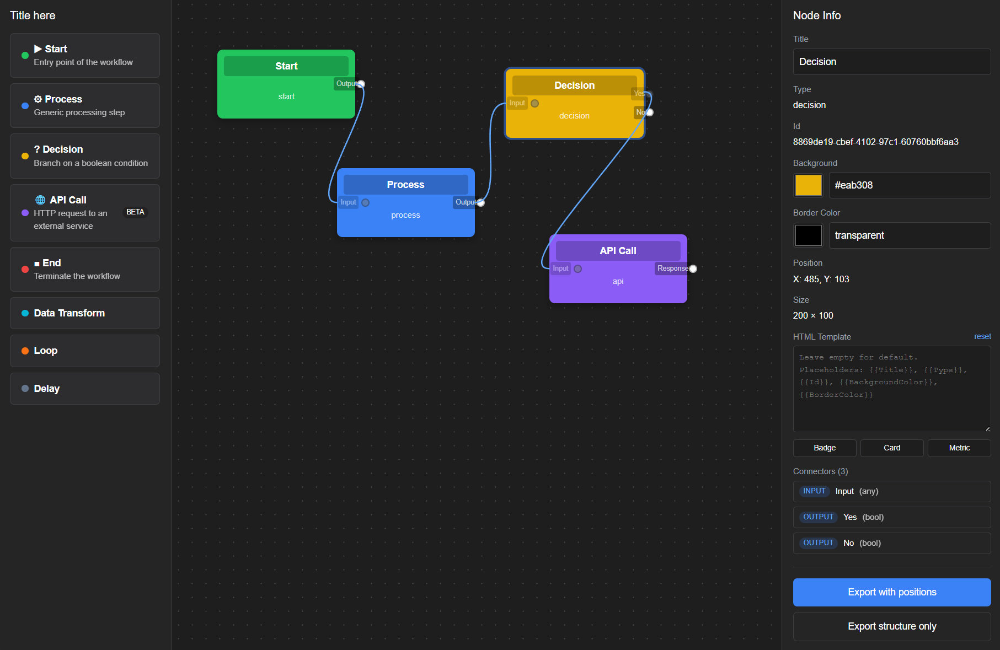

# Nodler

A Blazor WebAssembly workflow designer component. Drop in a `<WorkflowDesigner>`, define your node types, and get a draggable palette, a connectable canvas, theming, custom templates, and JSON import/export out of the box.




The screenshot above shows the demo app: a palette of node types on the left (Start, Process, Decision, API Call, End, Data Transform, Loop, Delay), a connectable canvas in the middle with wired-up nodes, and a Node Info panel on the right for live-editing the selected node — title, type, colors, position, size, HTML template, template presets (Badge / Card / Metric), connectors, and JSON export.

## Install

```bash
dotnet add package Nodler
```

The library targets `net10.0` and ships as a Razor Class Library with the `browser` supported platform.

## Quick start

Add the namespace to `_Imports.razor`:

```razor
@using Nodler
```

Drop the component into a page:

```razor
@page "/"

<div style="height: 100vh;">
    <WorkflowDesigner State="state"
                      NodeTypes="nodeTypes"
                      NodeClicked="OnNodeClicked"
                      CanvasChanged="OnCanvasChanged" />
</div>

@code {
    private WorkflowDesignerState state = new();

    private List<NodeType> nodeTypes = new()
    {
        new() {
            Title = "Start",
            Type = "start",
            Color = "#22c55e",
            Icon = "▶",
            Description = "Entry point of the workflow",
            Category = "Flow",
            Connectors = new()
            {
                new() { Label = "Output", Type = ConnectorType.Output, DataType = "any" }
            }
        },
        new() {
            Title = "End",
            Type = "end",
            Color = "#ef4444",
            Icon = "■",
            Connectors = new()
            {
                new() { Label = "Input", Type = ConnectorType.Input, DataType = "any" }
            }
        }
    };

    private void OnNodeClicked(WorkflowNode node) { }
    private void OnCanvasChanged(CanvasChangedEventArgs e) { }
}
```

That's it. Drag from the palette on the left onto the canvas, click an output connector then an input connector to connect two nodes, and double-click a connection to delete it.

## Defining node types

`NodeType` is the template that lives in the palette. Every property except `Title`, `Type`, and `Color` is optional.

```csharp
new NodeType
{
    Title       = "API Call",
    Type        = "api",
    Color       = "#8b5cf6",
    Icon        = "🌐",          // emoji or text icon
    IconUrl     = null,           // or a URL to an image
    Description = "HTTP request to an external service",
    Category    = "Integration",
    Badge       = "BETA",
    TextColor   = null,
    BorderColor = null,
    CssClass    = null,
    Style       = null,
    Connectors  = new()
    {
        new() { Label = "Input",    Type = ConnectorType.Input,  DataType = "any",  MaxConnections = 1 },
        new() { Label = "Response", Type = ConnectorType.Output, DataType = "json" }
    }
}
```

`MaxConnections = 0` means unlimited; any positive value caps how many wires can attach to that connector. The designer enforces the cap on both source and target sides when wiring.

## State and JSON

`WorkflowDesignerState` is a plain object you own. You can bind to it, mutate it, or load it from JSON.

```csharp
// Export including X/Y positions (useful for round-tripping the canvas)
string fullJson = state.ToJson();

// Export logical structure only — no coordinates, sizes
string structureJson = state.ToJson(includePosition: false);

// Load from JSON
var loaded = WorkflowDesignerState.FromJson(json);
```

The state exposes `Nodes`, `Connections`, `SelectedNode`, and the in-flight connector selection fields. Each `WorkflowNode` carries a `Properties` dictionary you can use as a free-form bag for your own data.

## Events

| Parameter           | Type                                       | Fires when                                                           |
| ------------------- | ------------------------------------------ | -------------------------------------------------------------------- |
| `NodeClicked`       | `EventCallback<WorkflowNode>`              | A node is clicked.                                                   |
| `SelectionChanged`  | `EventCallback<WorkflowNode?>`             | The selected node changes (or clears).                               |
| `ConnectorClicked`  | `EventCallback<ConnectorClickedEventArgs>` | A connector is clicked (before wiring resolves).                     |
| `CanvasChanged`     | `EventCallback<CanvasChangedEventArgs>`    | A node is added/moved or a connection is added/deleted.              |

`CanvasChangedEventArgs.ChangeType` is one of `NodeAdded`, `NodeDeleted`, `NodeUpdated`, `NodeMoved`, `ConnectionAdded`, `ConnectionDeleted`.

## Theming

The designer ships with `dark` and `light` themes. Use one-way binding for a fixed theme, or two-way binding plus the built-in toggle button:

```razor
<WorkflowDesigner State="state"
                  NodeTypes="nodeTypes"
                  @bind-Theme="theme"
                  ShowThemeToggle="true" />

@code {
    private string theme = "dark";
}
```

| Parameter         | Default       | Notes                                                       |
| ----------------- | ------------- | ----------------------------------------------------------- |
| `Theme`           | `"dark"`      | `"dark"` or `"light"`.                                      |
| `ThemeChanged`    | —             | Two-way binding callback (use `@bind-Theme`).               |
| `ShowThemeToggle` | `true`        | Renders the toolbar header toggle button.                   |
| `PaletteTitle`    | `"Node Types"`| Header text above the palette. Set to `null`/`""` to hide.  |

## Custom palette templates

Override how each card renders in the palette by supplying a `PaletteNodeTemplate`. The outer draggable container stays owned by the designer, so drag-and-drop keeps working without any wiring on your side.

```razor
<WorkflowDesigner State="state" NodeTypes="nodeTypes">
    <PaletteNodeTemplate Context="nt">
        <div style="display:flex; align-items:center; gap:8px;">
            <span style="width:10px; height:10px; border-radius:50%;
                         background:@nt.Color;"></span>
            <strong>@nt.Icon @nt.Title</strong>
            @if (!string.IsNullOrEmpty(nt.Badge))
            {
                <span style="margin-left:auto;">@nt.Badge</span>
            }
        </div>
    </PaletteNodeTemplate>
</WorkflowDesigner>
```

## Custom node templates on the canvas

Each `WorkflowNode` has an optional `Template` property. When set, the node renders that HTML with placeholder substitution instead of the default chrome.

Supported placeholders:

| Placeholder           | Replaced with             |
| --------------------- | ------------------------- |
| `{{Title}}`           | `node.Title`              |
| `{{Type}}`            | `node.Type`               |
| `{{Id}}`              | `node.Id`                 |
| `{{BackgroundColor}}` | `node.BackgroundColor`    |
| `{{BorderColor}}`     | `node.BorderColor`        |

Example — render a node as a centered metric card:

```csharp
node.Template =
    "<div style=\"display:flex;flex-direction:column;align-items:center;" +
    "justify-content:center;height:100%;\">" +
    "<div style=\"font-size:22px;font-weight:700;\">{{Title}}</div>" +
    "<div style=\"font-size:10px;opacity:0.7;text-transform:uppercase;\">{{Type}}</div>" +
    "</div>";
```

Set `Template = null` to fall back to the default node rendering.

## Demo

A full-featured demo app lives in [Nodler.Demo/](Nodler.Demo/). It shows:

- A populated palette with icons, descriptions, categories, and a `BETA` badge
- A side panel for live-editing the selected node (title, colors, template)
- Template presets (Badge / Card / Metric)
- JSON export — both with positions and structure-only
- Wiring up `NodeClicked`, `ConnectorClicked`, and `CanvasChanged` to the browser console

Run it locally:

```bash
dotnet run --project Nodler.Demo
```

Then open the URL the dev server prints.

## Project layout

```
Nodler/             # The Razor Class Library (shipped as the NuGet package)
  WorkflowDesigner.razor
  WorkflowNodeComponent.razor
  WorkflowConnection.razor
  WorkflowConnectionDrag.razor
  Models/
Nodler.Demo/        # Blazor WebAssembly demo app
```

## License

See the repository for license information.
